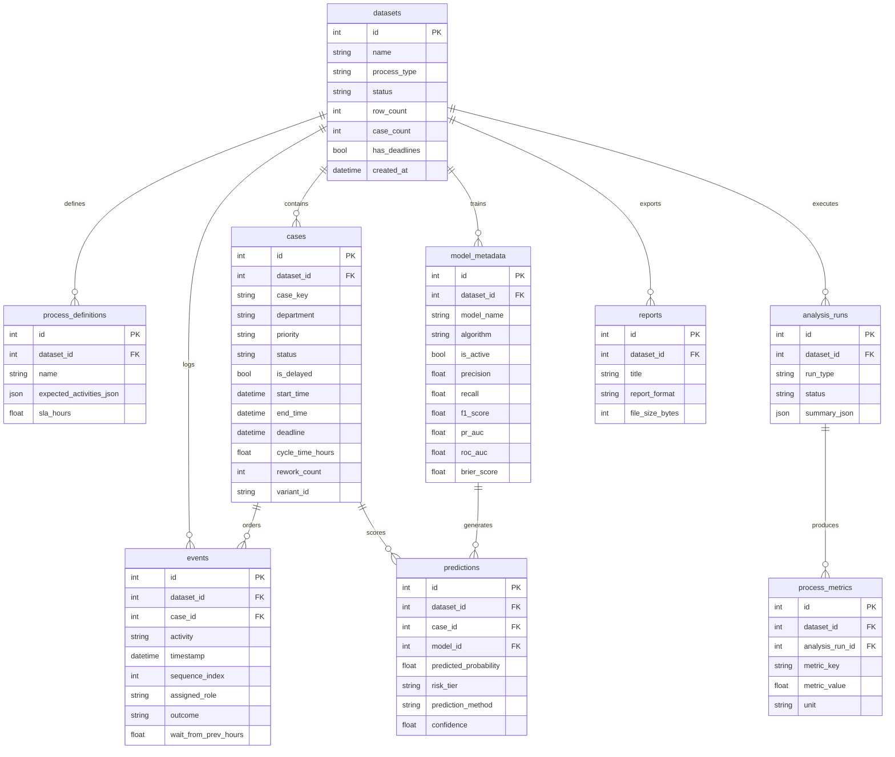

# Orqestra AI — Database Schema & ERD

## Entity Relationship Diagram

```mermaid
erDiagram
    datasets ||--o{ process_definitions : defines
    datasets ||--o{ cases : contains
    datasets ||--o{ events : logs
    datasets ||--o{ analysis_runs : executes
    datasets ||--o{ model_metadata : trains
    datasets ||--o{ reports : exports
    cases ||--o{ events : orders
    cases ||--o{ predictions : scores
    analysis_runs ||--o{ process_metrics : produces
    model_metadata ||--o{ predictions : generates

    datasets {
        int id PK
        string name
        string process_type
        string status
        int row_count
        int case_count
        bool has_deadlines
        datetime created_at
    }
    process_definitions {
        int id PK
        int dataset_id FK
        string name
        json expected_activities_json
        float sla_hours
    }
    cases {
        int id PK
        int dataset_id FK
        string case_key
        string department
        string priority
        string status
        bool is_delayed
        datetime start_time
        datetime end_time
        datetime deadline
        float cycle_time_hours
        int rework_count
        string variant_id
    }
    events {
        int id PK
        int dataset_id FK
        int case_id FK
        string activity
        datetime timestamp
        int sequence_index
        string assigned_role
        string outcome
        float wait_from_prev_hours
    }
    analysis_runs {
        int id PK
        int dataset_id FK
        string run_type
        string status
        json summary_json
    }
    process_metrics {
        int id PK
        int dataset_id FK
        int analysis_run_id FK
        string metric_key
        float metric_value
        string unit
    }
    model_metadata {
        int id PK
        int dataset_id FK
        string model_name
        string algorithm
        bool is_active
        float precision
        float recall
        float f1_score
        float pr_auc
        float roc_auc
        float brier_score
    }
    predictions {
        int id PK
        int dataset_id FK
        int case_id FK
        int model_id FK
        float predicted_probability
        string risk_tier
        string prediction_method
        float confidence
    }
    reports {
        int id PK
        int dataset_id FK
        string title
        string report_format
        int file_size_bytes
    }
```
